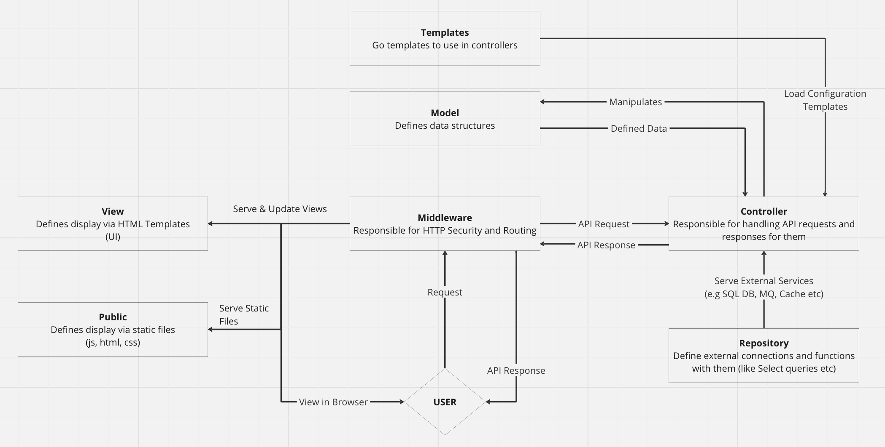

# GoBlitz

> :warning: **NOTE:** This project is currently under development and does not have a stable version yet. Please use with caution.

GoBlitz is a powerful framework built on top of Gin Gonic, designed to help develop production ready web applications in Golang. GoBlitz creates an abstraction layer for the Gin-Gonic framework and provides a structured way to build web applications. It is designed to be fast, secure, and easy to use. The framework is built with security in mind and provides a set of security features to protect web applications from common web vulnerabilities.

You can look for GoBlitz benchmarks [here](#benchmarks).

Feel free to fork this repository as website boilerplate for your next project.


## Architectural overview


## Technologies used

- [Dependabot](https://github.com/dependabot) - Dependency Management
- [Gin Gonic](https://github.com/gin-gonic/gin) - Golang Web Framework
- [Goose](https://github.com/pressly/goose) - Golang Migrations framework
- [GoDotEnv](https://github.com/joho/godotenv) - Golang .env file parser
- [Golang CI Lint](https://github.com/golangci/golangci-lint) - Golang Linter
- [GoSec](https://github.com/securego/gosec) - Golang Security Scan
- [TailwindCSS](https://tailwindcss.com/docs/installation/play-cdn) - CSS Framework from the CDN
- [Air](https://github.com/cosmtrek/air) - Live reload for Go applications

## Features

- Container Compatible
- Comprehensive code quality scan
- Error Handling
- Go Templates
- Go Autoloader via Air
- Migrations via Goose
- PostgreSQL Connection
- HTML Templates
- Production-Ready Code Check
- Simple Ping JSON API at /api/v1/ping
- Simple Status page at /status
- Security Headers & SSRF Protection
- Static site serving at root path (/)

## Folder structure

- `bin`- Binary folder for the web application. Mostly used for different scripts or when compiling Go code
- `docs` - Web Application documentation
- `controller` - Controller component (in MVC architecture) folder. Contain the logic for the web application (e.g. API, Error Handling, etc.)
- `controller/api` - API request and response handling
- `controller/error` - Error handling
- `middleware` - Middleware layer (in layered architecture) used as HTTP Web Server for API routes, static site serving, etc. 
- `migrations/` - Database migrations for the web application
- `model` - Model component (in MVC architecture) folder which contain data structures where data is handled.
- `public` - View component (in MVC architecture) folder used to store static website.
- `public/errors` - Error pages served by the web application
- `repository`- Repository is a layer (in layered architecture) that connects the application to external services like databases, cache servers, etc.
- `templates` - GO Templates mostly contain dynamic configuration for the controller
- `tests` - GO Unit Tests for the web application
- `views` - View component (in MVC architecture) folder used to store HTML templates.

## Benchmarks

Benchmarks are done via ApacheBench. We're comparing here the performance of default web application written via Go and Laravel against /api/v1/ping endpoint which contains only JSON message: `{"message": "pong"}`.

### GoBlitz

1. 100 requests and 10 concurrenct connections

```
ab -n 100 -c 10 -k http://localhost:8000/api/v1/ping
This is ApacheBench, Version 2.3 <$Revision: 1903618 $>
Copyright 1996 Adam Twiss, Zeus Technology Ltd, http://www.zeustech.net/
Licensed to The Apache Software Foundation, http://www.apache.org/

Benchmarking localhost (be patient).....done


Server Software:        
Server Hostname:        localhost
Server Port:            8000

Document Path:          /api/v1/ping
Document Length:        571 bytes

Concurrency Level:      10
Time taken for tests:   0.012 seconds
Complete requests:      100
Failed requests:        0
Keep-Alive requests:    100
Total transferred:      123300 bytes
HTML transferred:       57100 bytes
Requests per second:    8602.15 [#/sec] (mean)
Time per request:       1.162 [ms] (mean)
Time per request:       0.116 [ms] (mean, across all concurrent requests)
Transfer rate:          10357.86 [Kbytes/sec] received

Connection Times (ms)
              min  mean[+/-sd] median   max
Connect:        0    0   0.1      0       0
Processing:     1    1   0.3      1       3
Waiting:        1    1   0.3      1       2
Total:          1    1   0.4      1       3

Percentage of the requests served within a certain time (ms)
  50%      1
  66%      1
  75%      1
  80%      1
  90%      1
  95%      1
  98%      2
  99%      3
 100%      3 (longest request)
```

2. 100 requests and 100 concurrenct connections

```
ab -n 100 -c 100 -k http://localhost:8000/api/v1/ping
This is ApacheBench, Version 2.3 <$Revision: 1903618 $>
Copyright 1996 Adam Twiss, Zeus Technology Ltd, http://www.zeustech.net/
Licensed to The Apache Software Foundation, http://www.apache.org/

Benchmarking localhost (be patient).....done


Server Software:        
Server Hostname:        localhost
Server Port:            8000

Document Path:          /api/v1/ping
Document Length:        571 bytes

Concurrency Level:      100
Time taken for tests:   0.013 seconds
Complete requests:      100
Failed requests:        0
Keep-Alive requests:    100
Total transferred:      123300 bytes
HTML transferred:       57100 bytes
Requests per second:    7521.06 [#/sec] (mean)
Time per request:       13.296 [ms] (mean)
Time per request:       0.133 [ms] (mean, across all concurrent requests)
Transfer rate:          9056.12 [Kbytes/sec] received

Connection Times (ms)
              min  mean[+/-sd] median   max
Connect:        0    3   0.5      3       3
Processing:     4    5   0.4      5       6
Waiting:        2    5   0.5      5       6
Total:          4    8   0.6      8       9

Percentage of the requests served within a certain time (ms)
  50%      8
  66%      8
  75%      8
  80%      8
  90%      8
  95%      8
  98%      9
  99%      9
 100%      9 (longest request)
```

3. 1000 requests and 100 concurrenct connections

```
ab -n 1000 -c 100 -k http://localhost:8000/api/v1/ping
This is ApacheBench, Version 2.3 <$Revision: 1903618 $>
Copyright 1996 Adam Twiss, Zeus Technology Ltd, http://www.zeustech.net/
Licensed to The Apache Software Foundation, http://www.apache.org/

Benchmarking localhost (be patient)
Completed 100 requests
Completed 200 requests
Completed 300 requests
Completed 400 requests
Completed 500 requests
Completed 600 requests
Completed 700 requests
Completed 800 requests
Completed 900 requests
Completed 1000 requests
Finished 1000 requests


Server Software:        
Server Hostname:        localhost
Server Port:            8000

Document Path:          /api/v1/ping
Document Length:        571 bytes

Concurrency Level:      100
Time taken for tests:   0.057 seconds
Complete requests:      1000
Failed requests:        0
Keep-Alive requests:    1000
Total transferred:      1233000 bytes
HTML transferred:       571000 bytes
Requests per second:    17653.19 [#/sec] (mean)
Time per request:       5.665 [ms] (mean)
Time per request:       0.057 [ms] (mean, across all concurrent requests)
Transfer rate:          21256.23 [Kbytes/sec] received

Connection Times (ms)
              min  mean[+/-sd] median   max
Connect:        0    0   0.9      0       3
Processing:     1    5   1.5      5      12
Waiting:        1    5   1.5      5      12
Total:          1    5   1.9      5      12

Percentage of the requests served within a certain time (ms)
  50%      5
  66%      6
  75%      6
  80%      6
  90%      8
  95%      9
  98%      9
  99%     10
 100%     12 (longest request)
```

### Laravel 11 (default)

1. 100 requests and 10 concurrenct connections

```
ab -n 100 -c 10 -k http://127.0.0.1:8000/api/v1/ping
This is ApacheBench, Version 2.3 <$Revision: 1903618 $>
Copyright 1996 Adam Twiss, Zeus Technology Ltd, http://www.zeustech.net/
Licensed to The Apache Software Foundation, http://www.apache.org/

Benchmarking 127.0.0.1 (be patient).....done


Server Software:        
Server Hostname:        127.0.0.1
Server Port:            8000

Document Path:          /api/v1/ping
Document Length:        18 bytes

Concurrency Level:      10
Time taken for tests:   0.754 seconds
Complete requests:      100
Failed requests:        0
Keep-Alive requests:    0
Total transferred:      117500 bytes
HTML transferred:       1800 bytes
Requests per second:    132.58 [#/sec] (mean)
Time per request:       75.425 [ms] (mean)
Time per request:       7.543 [ms] (mean, across all concurrent requests)
Transfer rate:          152.13 [Kbytes/sec] received

Connection Times (ms)
              min  mean[+/-sd] median   max
Connect:        0    0   0.1      0       1
Processing:     9   70  14.9     72      91
Waiting:        9   70  14.9     72      91
Total:          9   70  14.9     72      91

Percentage of the requests served within a certain time (ms)
  50%     72
  66%     77
  75%     81
  80%     82
  90%     87
  95%     89
  98%     90
  99%     91
 100%     91 (longest request)
```
2. 100 requests and 100 concurrenct connections

```
ab -n 100 -c 100 -k http://127.0.0.1:8000/api/v1/ping
This is ApacheBench, Version 2.3 <$Revision: 1903618 $>
Copyright 1996 Adam Twiss, Zeus Technology Ltd, http://www.zeustech.net/
Licensed to The Apache Software Foundation, http://www.apache.org/

Benchmarking 127.0.0.1 (be patient).....done


Server Software:        
Server Hostname:        127.0.0.1
Server Port:            8000

Document Path:          /api/v1/ping
Document Length:        18 bytes

Concurrency Level:      100
Time taken for tests:   0.773 seconds
Complete requests:      100
Failed requests:        0
Keep-Alive requests:    0
Total transferred:      117500 bytes
HTML transferred:       1800 bytes
Requests per second:    129.33 [#/sec] (mean)
Time per request:       773.239 [ms] (mean)
Time per request:       7.732 [ms] (mean, across all concurrent requests)
Transfer rate:          148.40 [Kbytes/sec] received

Connection Times (ms)
              min  mean[+/-sd] median   max
Connect:        0    3   0.4      3       4
Processing:    12  378 220.1    377     755
Waiting:       11  378 220.2    377     755
Total:         15  381 220.1    379     758

Percentage of the requests served within a certain time (ms)
  50%    379
  66%    503
  75%    579
  80%    616
  90%    689
  95%    728
  98%    748
  99%    758
 100%    758 (longest request)
```

3. 1000 requests and 100 concurrenct connections

```
ab -n 1000 -c 100 -k http://127.0.0.1:8000/api/v1/ping
This is ApacheBench, Version 2.3 <$Revision: 1903618 $>
Copyright 1996 Adam Twiss, Zeus Technology Ltd, http://www.zeustech.net/
Licensed to The Apache Software Foundation, http://www.apache.org/

Benchmarking 127.0.0.1 (be patient)
Completed 100 requests
Completed 200 requests
Completed 300 requests
Completed 400 requests
Completed 500 requests
Completed 600 requests
Completed 700 requests
Completed 800 requests
Completed 900 requests
Completed 1000 requests
Finished 1000 requests


Server Software:        
Server Hostname:        127.0.0.1
Server Port:            8000

Document Path:          /api/v1/ping
Document Length:        18 bytes

Concurrency Level:      100
Time taken for tests:   7.624 seconds
Complete requests:      1000
Failed requests:        0
Keep-Alive requests:    0
Total transferred:      1175000 bytes
HTML transferred:       18000 bytes
Requests per second:    131.17 [#/sec] (mean)
Time per request:       762.389 [ms] (mean)
Time per request:       7.624 [ms] (mean, across all concurrent requests)
Transfer rate:          150.51 [Kbytes/sec] received

Connection Times (ms)
              min  mean[+/-sd] median   max
Connect:        0    0   0.8      0       3
Processing:    10  718 148.4    774     851
Waiting:       10  718 148.4    774     851
Total:         14  718 147.8    775     851

Percentage of the requests served within a certain time (ms)
  50%    775
  66%    789
  75%    799
  80%    806
  90%    819
  95%    832
  98%    843
  99%    847
 100%    851 (longest request)
```

### Node Express

1. 100 requests and 10 concurrenct connections

```
ab -n 100 -c 10 -k http://localhost:3000/
This is ApacheBench, Version 2.3 <$Revision: 1903618 $>
Copyright 1996 Adam Twiss, Zeus Technology Ltd, http://www.zeustech.net/
Licensed to The Apache Software Foundation, http://www.apache.org/

Benchmarking localhost (be patient).....done


Server Software:        
Server Hostname:        localhost
Server Port:            3000

Document Path:          /
Document Length:        139 bytes

Concurrency Level:      10
Time taken for tests:   0.055 seconds
Complete requests:      100
Failed requests:        0
Non-2xx responses:      100
Keep-Alive requests:    100
Total transferred:      41100 bytes
HTML transferred:       13900 bytes
Requests per second:    1822.95 [#/sec] (mean)
Time per request:       5.486 [ms] (mean)
Time per request:       0.549 [ms] (mean, across all concurrent requests)
Transfer rate:          731.67 [Kbytes/sec] received

Connection Times (ms)
              min  mean[+/-sd] median   max
Connect:        0    0   0.1      0       1
Processing:     1    4   6.7      2      34
Waiting:        1    4   6.7      2      34
Total:          1    4   6.8      2      34

Percentage of the requests served within a certain time (ms)
  50%      2
  66%      2
  75%      4
  80%      4
  90%     10
  95%     27
  98%     32
  99%     34
 100%     34 (longest request)
```

2. 100 requests and 100 concurrenct connections

```
ab -n 100 -c 100 -k http://localhost:3000/
This is ApacheBench, Version 2.3 <$Revision: 1903618 $>
Copyright 1996 Adam Twiss, Zeus Technology Ltd, http://www.zeustech.net/
Licensed to The Apache Software Foundation, http://www.apache.org/

Benchmarking localhost (be patient).....done


Server Software:        
Server Hostname:        localhost
Server Port:            3000

Document Path:          /
Document Length:        139 bytes

Concurrency Level:      100
Time taken for tests:   0.038 seconds
Complete requests:      100
Failed requests:        0
Non-2xx responses:      100
Keep-Alive requests:    100
Total transferred:      41100 bytes
HTML transferred:       13900 bytes
Requests per second:    2624.81 [#/sec] (mean)
Time per request:       38.098 [ms] (mean)
Time per request:       0.381 [ms] (mean, across all concurrent requests)
Transfer rate:          1053.51 [Kbytes/sec] received

Connection Times (ms)
              min  mean[+/-sd] median   max
Connect:        0    7   1.6      7       8
Processing:     7   13   5.4     12      24
Waiting:        2   13   5.5     12      24
Total:          7   20   6.4     20      31

Percentage of the requests served within a certain time (ms)
  50%     20
  66%     23
  75%     26
  80%     26
  90%     29
  95%     30
  98%     31
  99%     31
 100%     31 (longest request)
```

3. 1000 requests and 100 concurrenct connections

```
ab -n 1000 -c 100 -k http://localhost:3000/
This is ApacheBench, Version 2.3 <$Revision: 1903618 $>
Copyright 1996 Adam Twiss, Zeus Technology Ltd, http://www.zeustech.net/
Licensed to The Apache Software Foundation, http://www.apache.org/

Benchmarking localhost (be patient)
Completed 100 requests
Completed 200 requests
Completed 300 requests
Completed 400 requests
Completed 500 requests
Completed 600 requests
Completed 700 requests
Completed 800 requests
Completed 900 requests
Completed 1000 requests
Finished 1000 requests


Server Software:        
Server Hostname:        localhost
Server Port:            3000

Document Path:          /
Document Length:        139 bytes

Concurrency Level:      100
Time taken for tests:   0.139 seconds
Complete requests:      1000
Failed requests:        0
Non-2xx responses:      1000
Keep-Alive requests:    1000
Total transferred:      411000 bytes
HTML transferred:       139000 bytes
Requests per second:    7208.77 [#/sec] (mean)
Time per request:       13.872 [ms] (mean)
Time per request:       0.139 [ms] (mean, across all concurrent requests)
Transfer rate:          2893.36 [Kbytes/sec] received

Connection Times (ms)
              min  mean[+/-sd] median   max
Connect:        0    0   1.5      0       6
Processing:     1   12  27.9      5     127
Waiting:        1   12  27.9      5     126
Total:          1   13  29.2      5     131

Percentage of the requests served within a certain time (ms)
  50%      5
  66%      5
  75%      5
  80%      6
  90%     10
  95%    127
  98%    129
  99%    131
 100%    131 (longest request)
```

## Available Make Commands

- `make build` - Build the application
- `make run` - Run the application
- `make test` - Run the tests
- `make fumpt` - Run the go fmt
- `make linter` - Run the comprehensive [GolangCILint](.golangci.yml) to check the code quality
- `make gosec` - Run the GoSec to check code for vulnerabilities
- `make mod-vendor` - Vendor the dependencies
- `make validate` - Runs `make linter`, `make test` and `make gosec` to validate the code
- `make migrate-create MIGRATION_NAME` - Create a new migration
- `make migrate-up` - Run the migrations
- `make migrate-down` - Rollback the migrations

## Available Paths

- `/` - Home page
- `/status` - Status page
- `API_PATH/ping` - API check endpoint
- `API_PATH/users` - Sample Users API endpoint

**Note!** Replace `API_PATH` with the actual path of the application. By default it's `/api/v1/`

## Getting Started

1. Clone the repository

```bash
git clone git@github.com:KostLinux/GoBlitz.git my-web-application
```

2. Change the directory

```bash
cd my-web-application
```

3. Configure .env

```bash
cp .env.example .env
nano .env
```

4. Run the application

```bash
make run || go run main.go
```

5. Visit the application in your browser

Feel free to visit the application at `localhost:8000` and move around available paths

## Running the application with Live Reload (Air)

1. Install Air

```bash
curl -sSfL https://raw.githubusercontent.com/cosmtrek/air/master/install.sh | sh -s
mv ./bin/air /usr/local/bin/air
```

2. Run the application with Air

```bash
make
```

## Docs

- [Setting up an example SQL Query and exposing the response to the middleware HTTP Router](./docs/controller/database_controller.md)

## Contribution

Feel free to contribute to the project by creating a pull request.

Make sure to follow the [Contribution Guidelines](https://docs.github.com/en/get-started/exploring-projects-on-github/contributing-to-a-project).